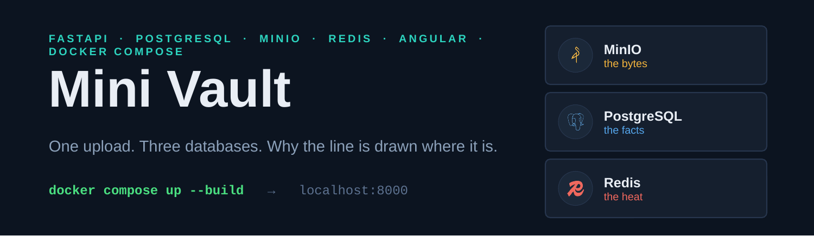
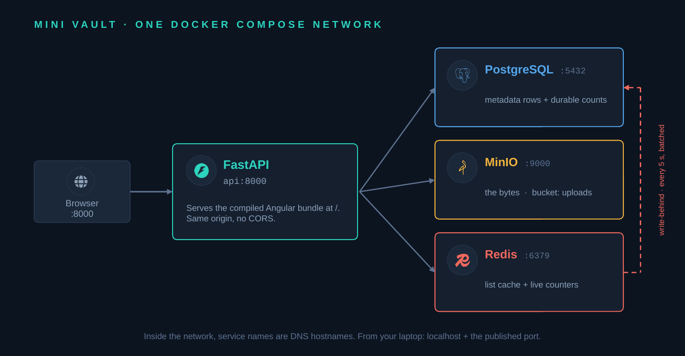
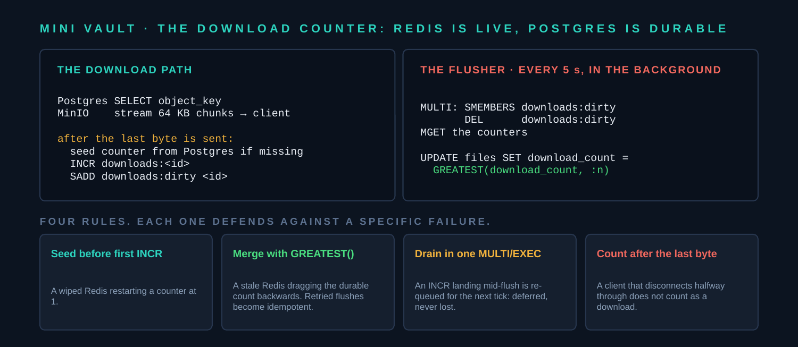

<p align="center">
  
</p>

<p align="center">
  
  
  
  
  
  
</p>

# Mini Vault

A deliberately small file storage service built to learn how these pieces fit together:
**FastAPI** for the HTTP API, **PostgreSQL** for metadata, **MinIO** for the file bytes,
**Redis** for caching and counters, **Angular** for the UI, and **Docker Compose** to run
it all with one command.

Upload a file and every service does work: the bytes land in MinIO, a metadata row lands
in Postgres, and Redis drops its cached listing so the next read is fresh. The dashboard
then shows you all four services describing themselves, live.

## Quick start

```bash
docker compose up --build
```

Then open:

| URL | What it is |
|---|---|
| http://localhost:8000 | The Angular app: upload, list, download, delete, and the live metrics dashboard |
| http://localhost:8000/docs | Swagger UI, auto-generated by FastAPI from the code |
| http://localhost:8000/metrics | The raw JSON behind the dashboard |
| http://localhost:9001 | MinIO web console (login: `minioadmin` / `minioadmin`) |

Stop with `Ctrl+C`. `docker compose down` removes the containers;
add `-v` to also wipe the stored data.

## Documentation

| Where | What |
|---|---|
| [`docs/Mini-Vault-Data-Flow.pptx`](docs/Mini-Vault-Data-Flow.pptx) | A 17-slide presentation of the whole design: the four request flows, the write-behind counter, trade-offs, and Q&A. The speaker notes carry timings and the exact live-demo commands. |
| [`docs/DATA_FLOW_TALK.md`](docs/DATA_FLOW_TALK.md) | The full talk script behind the slides, with step-by-step demos against a running stack. |
| [`docs/RUNNING.md`](docs/RUNNING.md) | Detailed local setup: prerequisites, configuration, ports, hot-reload dev loops, troubleshooting. |

## Architecture



One origin, one port. The Angular app is compiled in a Node build stage and copied into
the Python image, so the container that serves the API serves the UI too: no CORS, no
second server to start. The dashed arrow from Redis back to Postgres is the write-behind
counter flusher, covered in detail below and in [the presentation](docs/Mini-Vault-Data-Flow.pptx).

## What each piece does

**FastAPI** is the only thing clients talk to. It is a modern Python web framework where
the request and response types come from Python type hints, and those same hints generate
the interactive `/docs` page for free. See `app/main.py`: each route is a plain function.

**PostgreSQL** is the system of record. It holds one row per file: name, size, content
type, upload time, the key of the object in MinIO, and the durable `download_count`.
Relational databases are for structured data you query and join, not for multi-megabyte
blobs, which is why the bytes live elsewhere. It is also the only service here that can
`GROUP BY`, so it answers every aggregate on the dashboard. See `app/db.py`.

**MinIO** is self-hosted, S3-compatible object storage. Buckets hold objects; objects are
just named blobs. The client code in `app/storage.py` would work against real AWS S3 by
changing only the endpoint and credentials, which is exactly why teams use MinIO for local
development and on-premise deployments.

**Redis** is an in-memory data store doing three jobs here. One: cache. `GET /files` uses
the cache-aside pattern (check Redis, fall back to Postgres, store the result with a 30
second TTL). Two: live counters. Every completed download runs an atomic `INCR`, which is
microseconds against milliseconds for a Postgres write transaction. Three: the hit/miss
and event counters behind the dashboard, so the cache hit rate shown is *measured*, not
estimated. See `app/cache.py`.

**Angular** is the frontend: one standalone component, signals for state, `HttpClient` for
the API calls (Angular v22). Charts are hand-drawn SVG and CSS, no charting library.

**Docker Compose** describes all four services in one file and gives them a private
network where each service's name is a DNS hostname. That is why the API connects to
`postgres:5432` rather than `localhost:5432` when containerized. Healthchecks make
Compose hold the API back until the other three are actually ready.

## The request flows, step by step

**Upload** (`POST /files`): FastAPI reads the multipart body, writes the bytes to MinIO
under a UUID-prefixed key, inserts a metadata row in Postgres, then deletes the
`files:all` key in Redis so no stale listing survives the write.

**List** (`GET /files`): FastAPI asks Redis for `files:all`. On a hit it returns
immediately with `"source": "redis-cache"`. On a miss it queries Postgres, stores the
JSON in Redis with a TTL, and returns `"source": "postgres"`. Call it twice in a row and
watch the field flip; that flip is the cache-aside pattern working. Download counts are
**not** cached: they are merged onto the response from Redis with a single `MGET`, so a
30-second-old listing never carries a 30-second-old counter.

**Download** (`GET /files/{id}/download`): FastAPI looks the row up in Postgres to find
the object key and streams the bytes out of MinIO in 64 KB chunks. The counter is
incremented *after* the body has finished streaming, so the number reflects downloads
that completed rather than ones that merely started.

**Delete** (`DELETE /files/{id}`): remove the object from MinIO, delete the row from
Postgres, invalidate the cache and drop the counter in Redis.

**Metrics** (`GET /metrics`): aggregates from Postgres, counters and runtime stats from
Redis, and a live object count from MinIO. Each service is asked about itself.

## How the download counter stays correct



Counting downloads in Redis is fast but naive: a Redis restart would reset every counter
to zero, and the next `INCR` would restart a file with 57 downloads at 1. So the count
lives in **both** stores, with Redis in front:

- **Redis holds the live value** and serves every read of it.
- **Postgres holds the durable value**, mirrored by a write-behind flusher that runs every
  `COUNTER_FLUSH_SECONDS` (default 5) over a `downloads:dirty` set: one batched `UPDATE`
  instead of one write per download.
- A counter key is **seeded from Postgres before it is ever read or incremented**, so a
  Redis that lost its data can never restart a counter from zero.
- The flush writes `GREATEST(postgres, redis)`, so a stale Redis can never drag the
  durable count backwards, and a retried flush is harmless.
- Draining the dirty set is a single `MULTI/EXEC`. An `INCR` that lands mid-flush simply
  re-marks its id and is picked up next tick: an increment is never lost, only deferred.

You can watch the whole thing work:

```bash
ID=$(curl -s localhost:8000/files | python -c "import sys,json;print(json.load(sys.stdin)['files'][0]['id'])")

curl -s -o /dev/null localhost:8000/files/$ID/download   # count it
curl -s localhost:8000/files/$ID                          # live count, from Redis
docker compose exec postgres psql -U vault -d vault -c \
  "SELECT filename, download_count FROM files;"           # still behind, not flushed yet

sleep 6                                                   # let the flusher run
docker compose exec postgres psql -U vault -d vault -c \
  "SELECT filename, download_count FROM files;"           # now mirrored

docker compose exec redis redis-cli FLUSHALL              # simulate total Redis loss
curl -s localhost:8000/files/$ID                          # count survives: reseeded from Postgres
```

## Try the flow with curl

```bash
echo "hello econet" > note.txt

curl -F "file=@note.txt" localhost:8000/files          # upload
curl localhost:8000/files                               # "source": "postgres"
curl localhost:8000/files                               # "source": "redis-cache"
curl -OJ localhost:8000/files/<id>/download             # get the bytes back
curl localhost:8000/files/<id>                          # download_count, live from Redis
curl localhost:8000/metrics                             # the dashboard's data
curl -X DELETE localhost:8000/files/<id>
```

## Peek inside each service

```bash
docker compose exec postgres psql -U vault -d vault -c "TABLE files;"
docker compose exec redis redis-cli --scan
docker compose exec redis redis-cli ttl files:all
docker compose exec redis redis-cli smembers downloads:dirty   # counters awaiting flush
# MinIO: browse the uploads bucket at http://localhost:9001
```

## Working on the frontend

The image bakes the compiled bundle in, so `docker compose up` needs no Node. For fast
reload while editing Angular, run the dev server against the containerized API:

```bash
cd frontend
npm install
npm start        # http://localhost:4200, talking to the API on :8000
```

The app picks its API base from the port it is served on: relative URLs when FastAPI
serves it, `http://localhost:8000` under `ng serve`. CORS is open on the API, so no proxy
configuration is needed.

## Running the API without Docker

Useful when you want fast reload while editing the Python code. Keep Postgres, Redis and
MinIO running (via Compose is easiest: `docker compose up postgres redis minio`), then:

```bash
python -m venv .venv && source .venv/bin/activate   # Windows: .venv\Scripts\activate
pip install -r requirements.txt
cp .env.example .env
uvicorn app.main:app --reload
```

There is no compiled bundle in a plain checkout, so `/` answers with a hint instead of the
UI. Run the Angular dev server on `:4200` alongside it.

## The dashboard

Every chart plots a single series, so there is one colour and no legend; the extreme value
is labelled directly and every other value is reachable by hover, keyboard focus, or the
**Show data as tables** toggle. `files.count` (Postgres rows) and `minio.objects` are
counted independently and compared. If the two ever drift, the panel says so rather than
hiding it.

## Gotchas worth understanding

**Service names are hostnames.** Inside the Compose network, `postgres`, `redis` and
`minio` resolve like DNS names. From your host machine those names mean nothing; you use
`localhost` plus the published port. Confusing these two worlds is the most common
first-week Docker mistake.

**Startup order is a real problem.** Containers start fast; databases inside them get
ready slowly. Two defenses here: Compose `healthcheck` + `depends_on: condition:
service_healthy`, and a retry loop in the app itself (`wait_for_services` in
`app/main.py`). Belt and braces.

**`create_all` is not a migration strategy.** The app creates its table on startup, and
`init_db` carries an idempotent `ALTER TABLE … ADD COLUMN IF NOT EXISTS` because
`create_all` will never alter a table that already exists. That gap is exactly what
Alembic exists to fill.

**Don't cache a counter.** The cached listing holds metadata only. Caching
`download_count` alongside it would serve a number up to a TTL out of date, and the bug
would look like "the counter is slow" rather than "the counter is cached."

**Presigned URLs have a hostname trap.** MinIO can hand out temporary direct-download
URLs, but if the API generates one inside Docker it will contain `minio:9000`, which a
browser on your host cannot resolve. This demo streams download